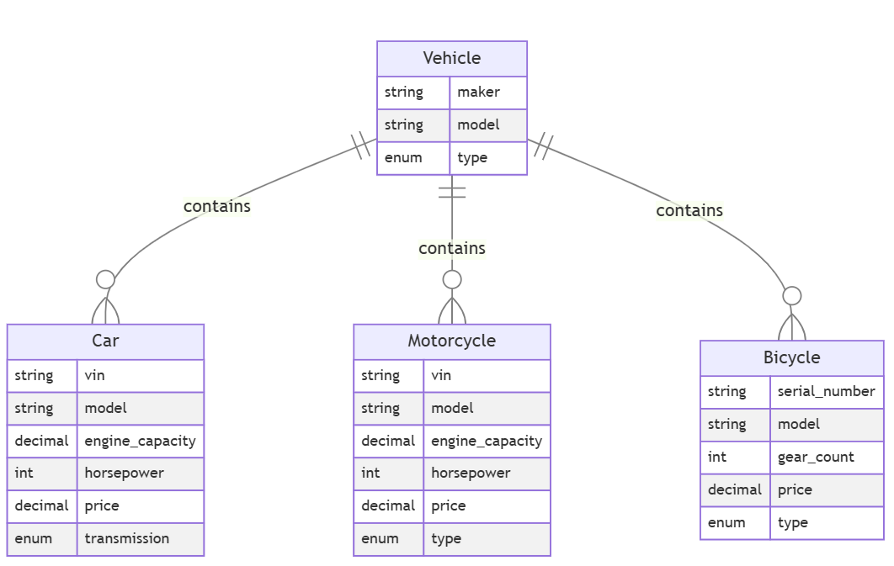

# Scripts to Create Tables

В этом файле собраны SQL-скрипты для создания таблиц базы данных (mySql) для первого задания по теме транспортные средства.

## 1. Создание таблицы `Vehicle`

```sql
CREATE TABLE Vehicle (
    maker VARCHAR(100) NOT NULL,
    model VARCHAR(100) NOT NULL,
    type ENUM('Car', 'Motorcycle', 'Bicycle') NOT NULL,
    PRIMARY KEY (model)
);
```

## 2. Создание таблицы `Car`

```sql
CREATE TABLE Car (
    vin VARCHAR(17) NOT NULL,
    model VARCHAR(100) NOT NULL,
    engine_capacity DECIMAL(4, 2) NOT NULL,  
    horsepower INT NOT NULL,  
    price DECIMAL(10, 2) NOT NULL,  
    transmission ENUM('Automatic', 'Manual') NOT NULL,  
    PRIMARY KEY (vin),
    FOREIGN KEY (model) REFERENCES Vehicle(model)
);
```

## 3. Создание таблицы `Motorcycle`

```sql
CREATE TABLE Motorcycle (
    vin VARCHAR(17) NOT NULL,
    model VARCHAR(100) NOT NULL,
    engine_capacity DECIMAL(4, 2) NOT NULL,  
    horsepower INT NOT NULL,  
    price DECIMAL(10, 2) NOT NULL,  
    type ENUM('Sport', 'Cruiser', 'Touring') NOT NULL,  
    PRIMARY KEY (vin),
    FOREIGN KEY (model) REFERENCES Vehicle(model)
);
```

## 4. Создание таблицы `Bicycle`

```sql
CREATE TABLE Bicycle (
    serial_number VARCHAR(20) NOT NULL,
    model VARCHAR(100) NOT NULL,
    gear_count INT NOT NULL, 
    price DECIMAL(10, 2) NOT NULL,  
    type ENUM('Mountain', 'Road', 'Hybrid') NOT NULL,  
    PRIMARY KEY (serial_number),
    FOREIGN KEY (model) REFERENCES Vehicle(model)
);
```
##  Схема базы данных 
