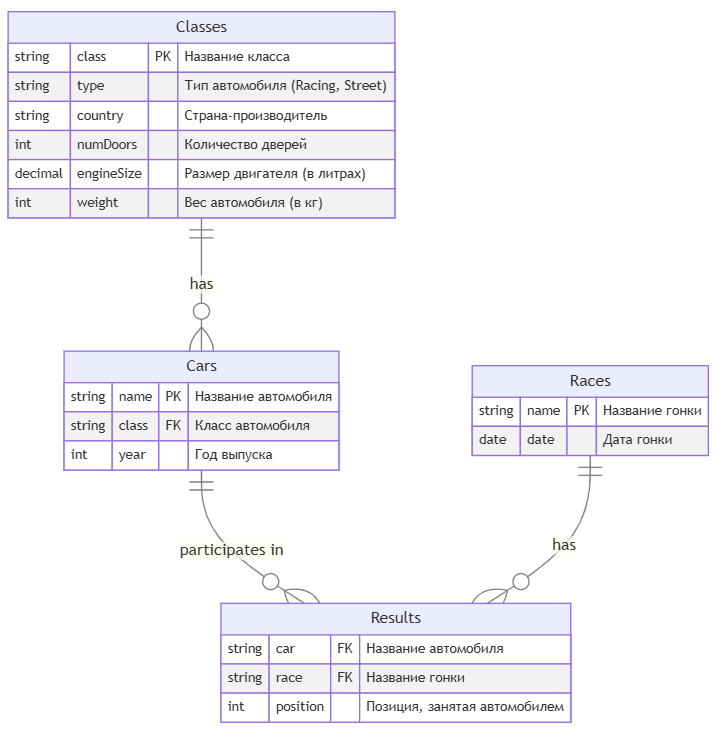

# Scripts to Create Tables

В этом файле собраны SQL-скрипты для создания таблиц базы данных по теме `autorace`.

## 1. Создание таблицы `Classes`

```sql
CREATE TABLE Classes (
    class VARCHAR(100) NOT NULL,
    type ENUM('Racing', 'Street') NOT NULL,
    country VARCHAR(100) NOT NULL,
    numDoors INT NOT NULL,
    engineSize DECIMAL(3, 1) NOT NULL, -- размер двигателя в литрах
    weight INT NOT NULL, -- вес автомобиля в килограммах
    PRIMARY KEY (class)
);
```

## 2. Создание таблицы `Cars`

```sql
CREATE TABLE Cars (
    name VARCHAR(100) NOT NULL,
    class VARCHAR(100) NOT NULL,
    year INT NOT NULL,
    PRIMARY KEY (name),
    FOREIGN KEY (class) REFERENCES Classes(class)
);
```

## 3. Создание таблицы `Races`

```sql
CREATE TABLE Races (
    name VARCHAR(100) NOT NULL,
    date DATE NOT NULL,
    PRIMARY KEY (name)
);
```

## 4. Создание таблицы `Results`

```sql
CREATE TABLE Results (
    car VARCHAR(100) NOT NULL,
    race VARCHAR(100) NOT NULL,
    position INT NOT NULL,
    PRIMARY KEY (car, race),
    FOREIGN KEY (car) REFERENCES Cars(name),
    FOREIGN KEY (race) REFERENCES Races(name)
);
```

## 5. Схема базы данных


